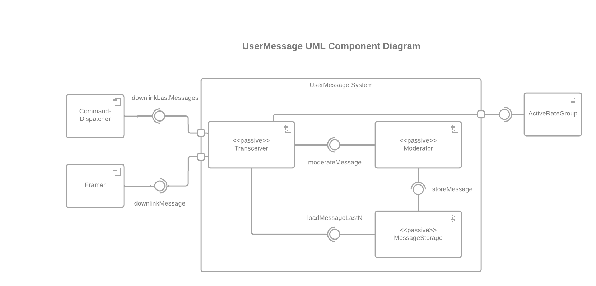

# F' UserMessage Extension
<!-- TODO: Shields? -->

## Purpose
Present and explains my work on MEMESat BBS Message Storage component.

Target Audience:
- Alice: Recruiter at XYZ Autos GmBH. HR Abteilung. Kaum Fachwissen
- Bob: Software Engineering Lead at Munich Dynamics. Softwareengineering und Robotikfachwissen
- Charly: UGA undergrad 2nd year. CE major. Team Member at SSRL that needs to fix a bug in my code after I have left.
- Danny: UGA undergrad 2nd year. CS major. Team Member at SSRL that needs to write a component which uses mine.

## Questions to answer

- Alice: What was the project about?
- Alice: What skills did he learn that apply to our job offering?
- Alice: Why was it challenging?
- Bob: What technical challenges did he solve?
- Bob: What technologies did he use? Do they match the one we use?
- Bob: Does he have good coding skills and does he follow software engineering best practices X
- Bob: Is his documentation easy to understand? X
- Charly: What do the different parts of the code do?
- Charly: Why is X implemented like that and not like ...?
- Charly: What can I change without breaking the design or functionality?
- Danny: How do I use the component?
- Danny: What is the component supposed to do? What is it for?

---

## Description
An implementation to receive, moderate, store, and send end-user text messages (called `UserMessage`) on a satellite using NASA JPL's F' embedded flight software framework.
## Table of Contents
- [F' UserMessage Extension](#f-usermessage-extension)
  - [Purpose](#purpose)
  - [Questions to answer](#questions-to-answer)
  - [Description](#description)
  - [Table of Contents](#table-of-contents)
  - [Technologies](#technologies)
  - [Features](#features)
  - [Design](#design)
    - [Component Model](#component-model)
    - [Dynamic Model](#dynamic-model)
  - [Installation](#installation)
  - [Usage](#usage)
    - [Example: Send Message to Satellite](#example-send-message-to-satellite)
    - [Example: Receive Message from Satellite](#example-receive-message-from-satellite)
  - [Tests](#tests)
  - [Credits](#credits)
  - [License](#license)

## Technologies
* C++-17
* NASA JPL's F' Flight Software Framework
* Google Test 2? for unit tests

## Features
The developed systems affords the following functionality:
* TODO

Zielbestimmung und Produkteinsatz:
* Was ist der Zweck des Produkts?
* Wo soll das Produkt eingesetzt werden? Auf einem Cubesat mit einem Raspberry Pi CM4.

AWfalldiagram:
* Ground Station Operator -> Ground Station -> Satellite
* HAM radio user -> Satellite
* Contains all functionality as a use case

Keep it short and concise!

## Design
Draft:
* Component Model
  * UML Component Diagram of all components: Internal + externally used ones
    * Transceiver
    * Moderator
    * MessageStorage
    * * 
    * ActiveRateGroup
    * CommandDispatcher
    * Framer??
  * Brief description of every component + link to their sdd
  * Design Decisions
    * Separation in components
      * MessageStorage as a separate component because it encapsulates general logic for storing `FW::Serializable` C++ objects to a file on the file system => Can be easily adapted to also storing other things than messages in the future
      * Moderator as separate component with the same interface (= same input port) as Message => Can be optionally plugged in between Transceiver and MessageStorage without neither Transceiver nor the MessageStorage knowing about it 
      * Transceiver encapsulates how loading and storing can be triggered => Can swap out the Transceiver with a different implementation to change how the satellite communicates messages with users on the ground
    * 

* Dynamic Model 
  
  The following UML sequence diagrams examplarily outline how the defined components interact to fulfill the two use-cases of receiving and downlinking messages.

  * Receive a message to store on the satellite
  * Downlink recently stored messages from the satellite
* 
---
### Component Model
The system is realized by introducing three new components and by interfacing with three components of the F' framework. 

UML component diagram:

<!-- TODO: Remove white edge -->

The following three components have been custom developed for this system:
   
  * **MessageStorage** (also see the [full component specification](doc/MessageStorage/SoftwareDesignDocumentation.md))

    Component with one port to accept a `UserMessage` to store it on the file system and another port to load a given number of recently stored `UserMessage`s.

    It is a separate component because it encapsulates the general logic for storing `Fw::Serializable` C++ objects in a file on the file system using the Operating System Abstraction Layer (OSAL) of F'. Thus, the component can easily be adapted to additionally store other types than only `UserMessage`s in the future.

* **Moderator** (also see the [full component specification](doc/Moderator/SoftwareDesignDocument.md))

	Component with one input port and one output port where `UserMessage`s given to the input port must pass a moderation check to be output on the output port. 

  It has the same interface for storing (i.e., with the same input port type) as the MessageStorage component. Thus, it can be optionally plugged in between the Transceiver component and the MessageStorage component without any of them knowing about the existence of the Moderator component. Therefore it is reasonable to have the Moderator as a separate component.

* **Transceiver** (also see the [full component specification](doc/Transceiver/SoftwareDesignDocument.md))

	Component to receive `UserMessage`s from users on the ground and to downlink the `UserMessage`s stored on the satellite to users on the ground.

  It is a separate component because it encapsulates how users can trigger the loading and storing of `UserMessage`s on the satellite. Consequently, the Transceiver implementation can be swapped out to change how the satellite communicates messages with users on the ground.

The system uses the following three framework components to integrate its functionality into the F' reference flight software system `Ref`:
* **[Svc.CommandDispatcher](#TODO)**: Receives commands sent to the satellite by ground station operators and forwards them to the appropriate component.
* **[Svc.ActiveRateGroup](#TODO)**: Calls the Transceiver component's `scheduleDownlink` port at a fixed rate to consistently trigger downlinking the `UserMessage`s stored on the satellite.
*  **[Svc.Framer](#TODO)**: Handles downlinking a given F' type to the ground station.
  <!-- TODO: Is Svc.Framer correct? -->

### Dynamic Model
The following UML sequence diagrams exemplarily outline how the defined components interact to fulfill the two use cases of receiving and downlinking messages. The custom-developed components are highlighted in orange.

**Receive a message to store on the satellite**

Two `UserMessage`s are sent to the satellite after each other. The first one is discarded during moderation, the second one passes moderation.


**Downlink recently stored messages from the satellite**

The system downlinks recently stored `UserMessage`s twice. The first time is response to a request via a command from the ground station. The second one is triggered by an ActiveRateGroup which calls the Transceiver's `scheduleDownlink` port.  


## Installation

Also provide System Requirements
- Must use an operating system for which an implementation for the Operating Systems Abstraction Layer (OSAL) of F' is provided. F' comes with such an implementation for Linux out-of-the-box. Implementations for other operating systems, like VWorks, ... # TODO
- A C++17 compiler

What are the steps required to install your project? Provide a step-by-step description of how to get the development environment running.

<!-- TODO: Can profit from fprime installation guide by including some of their instructions + finally linking to them -->

## Usage

Provide instructions and examples for use. Include screenshots as needed.

To add a screenshot, create an `assets/images` folder in your repository and upload your screenshot to it. Then, using the relative filepath, add it to your README using the following syntax:

    ```md
    
    ```
Draft:
* How to use it in an existing F' Flight Software System? Developers that wish to use the code of this repository can swap out the implementations for these components to fit the UserMessage system into their own  F' flight software system (see [Used Framwork Components](#component-model)).

### Example: Send Message to Satellite
Make sure to include at least one nicely visualized examples / tutorial.

### Example: Receive Message from Satellite
Make sure to include at least one nicely visualized examples / tutorial.

## Tests

Go the extra mile and write tests for your application. Then provide examples on how to run them here.

TODO: Unit tests provide ..% line coverage

## Credits

List your collaborators, if any, with links to their GitHub profiles.

If you used any third-party assets that require attribution, list the creators with links to their primary web presence in this section.

If you followed tutorials, include links to those here as well.
* Link fprime
* Purpose build for the requirements of a satellite mission at the University of Georgia's [Small Satellite Research Laboratory](http://www.smallsat.uga.edu/) (SSRL)


## License

Licensed under the [MIT License](LICENSE).
