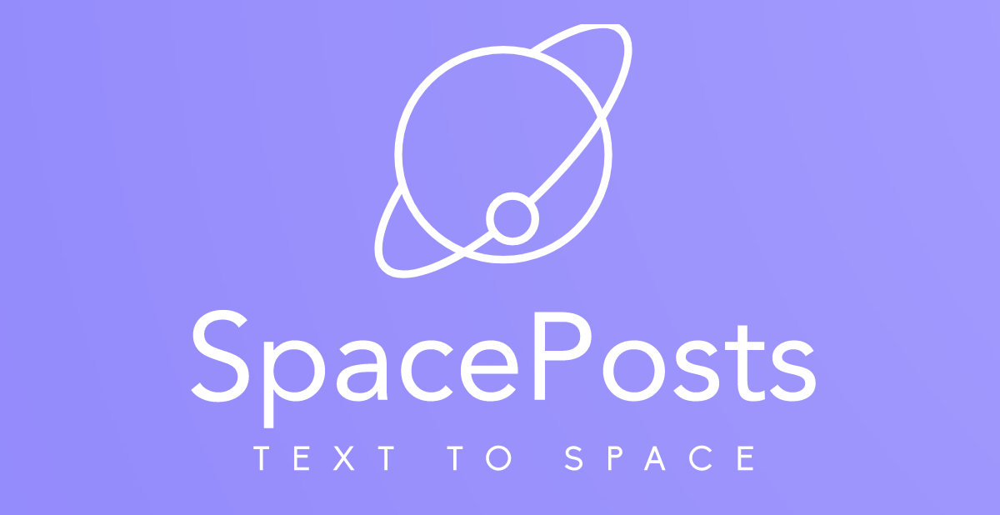
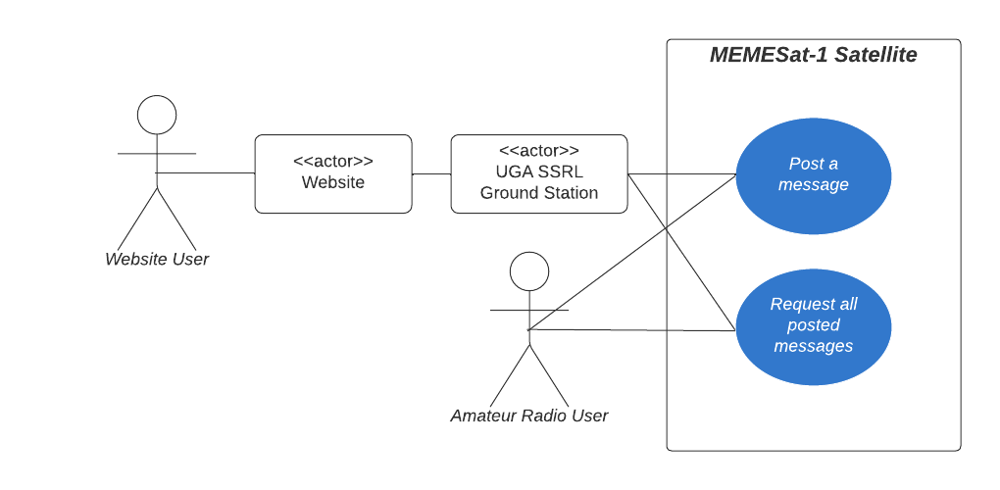
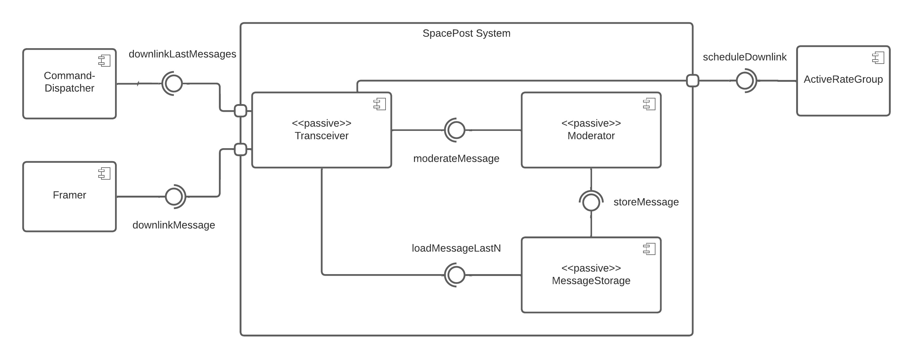
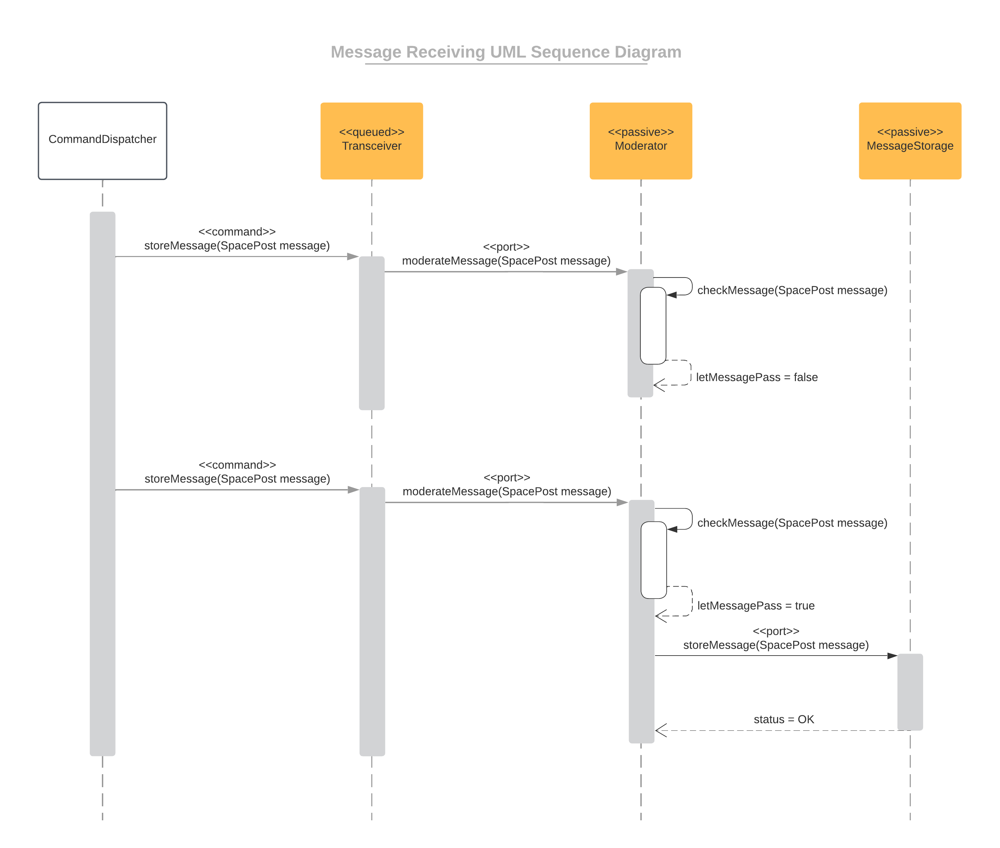
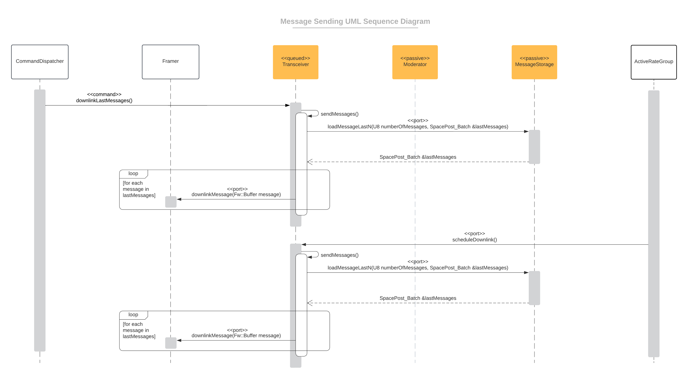

# F' SpacePosts
<!-- TODO: Shields?
  * LOC
  * Comments
  * Language: C++
 -->

## Summary

An implementation to receive, moderate, store, and send end-user text messages (called **SpacePosts**) on a satellite in embedded C++ using NASA JPL's F' flight software framework.

It enables users to publish their own text messages to a satellite and receive all other users' published text messages from that satellite.

<p align="center" float="left">
  <a href="#">
  
  </a>
  &nbsp;
  &nbsp;
  &nbsp;
  &nbsp;
  &nbsp;
  &nbsp;
  <a href="https://ieeexplore.ieee.org/document/10116009" target="_blank">
  
  </a>
</p>

## Table of Contents

  - [Summary](#summary) <!--DISABLED Auto Generation-->
  - [Table of Contents](#table-of-contents)
  - [Description](#description)
    - [Experience Gained From This Project](#experience-gained-from-this-project)
    - [The Concept of SpacePosts](#the-concept-of-spaceposts)
    - [Realization of SpacePosts](#realization-of-spaceposts)
  - [Technologies](#technologies)
    - [What is F'?](#what-is-f)
  - [Features](#features)
    - [Purpose and Environment](#purpose-and-environment)
    - [High-level Functionality (Functional Requirements)](#high-level-functionality-functional-requirements)
    - [UML Use Case Diagram](#uml-use-case-diagram)
  - [Design](#design)
    - [Component Model](#component-model)
    - [Dynamic Model](#dynamic-model)
  - [Tests](#tests)
  - [How To Use This Software](#how-to-use-this-software)
    - [Integration With An Existing F' Flight Software System](#integration-with-an-existing-f-flight-software-system)
    - [Installation](#installation)
  - [Credits](#credits)
  - [License](#license)

## Description

This repository presents one part of my contribution to the **[MEMESat-1](https://ieeexplore.ieee.org/document/10116009)** satellite during a 7-week full-time (40h/week) position as a **Flight Software Engineer** in the Command & Data Handling (CDH) team at the University of Georgia's **[Small Satellite Research Laboratory](http://www.smallsat.uga.edu/).**

<p align="center">
  <a href="http://www.smallsat.uga.edu/" target="_blank">
  
  </a>
</p>

### Experience Gained From This Project

<!-- TODO: Add numbers -->

- **Developed** **4 flight software components for a satellite** in **embedded C++17** with **2,600 lines of code** in **NASA**'s [F' framework](https://github.com/nasa/fprime) by designing, implementing, and testing them from scratch
- **Ensured** **space-grade code quality** standards with **100% line coverage** and **90% branch coverage** by data-driven unit testing with **GoogleTest** as well as thorough code reviews
- **Elicited the requirements** for the SpacePosts software product by discussing the desired functionality and security needs with [MEMESat-1](http://www.smallsat.uga.edu/missions)'s **mission leadership** and the [funding organization](https://letsgo2space.com/)'s **CEO**, resulting in a product that closely conforms with the satellite's mission goals
- **Documented the engineering process** extensively on **60 pages** with **2 lines of documentation per developed line of code** by establishing software engineering best practices in the embedded engineering team, resulting in **improved knowledge transfer** within the team

### The Concept of SpacePosts

SpacePosts realize a public [bulletin board](https://en.wikipedia.org/wiki/Bulletin_board_system) for text messages on a satellite in space. Anyone with amateur radio equipment shall be able to interact with the bulletin board. Essentially, users can post SpacePosts to the board and read all SpacePosts from the board. A SpacePost consists of a simple text message, just like a Tweet on Twitter.

For everyone without amateur radio equipment, there is a website that allows them to publish and read SpacePosts from the board through a ground station that handles transmitting and receiving.

<!--TODO Add conceptual figure: Earth, MEMESat in orbit, user sending message, others receiving message, "This is Alice from the U.S." -->

### Realization of SpacePosts

In fact, SpacePosts are not only a theoretical concept but they are being realized in the form of the **[MEMESat-1](https://doi.org/10.1109/AERO55745.2023.10116009)** CubeSat satellite at the **[University of Georgia's Small Satellite Research Laboratory](https://letsgo2space.com/talk-to-satellites/).**

MEMESat-1 is set to be launched into space in cooperation with NASA in Q2-2024. It is build for a [nonprofit organization](https://letsgo2space.com/memesatellite-1/) which will use the satellite in education workshops for high school students.


This repository spotlights how I contributed to MEMESat-1 by developing the entire satellite-side software system for SpacePosts on MEMESat-1. I defined, designed, implemented, and tested this software as one part of my work during a 7-week full-time (40h/week) position as a Flight Software Engineer in the Command & Data Handling (CDH) team.

<p align="center">
  <a href="http://www.smallsat.uga.edu/" target="_blank">
  
  </a>
</p>

## Technologies
* **C++17** Programming Language in **Embedded** Environment
* NASA JPL's **F' (*F Prime*)** Flight Software Framework
* **GoogleTest** Unit Test Framework
  
### What is F'?

[F´ (*F Prime*)](https://github.com/nasa/fprime) is an open-source component-driven framework for spaceflight and other embedded software applications. Originally developed at the [NASA JPL](https://www.jpl.nasa.gov/), F´ has been deployed on [several space applications](https://nasa.github.io/fprime/projects.html) like the Mars Helicopter Ingenuity. It is tailored but not limited to small-scale spaceflight systems such as CubeSats.

## Features

### Purpose and Environment

**Purpose**: The SpacePost system enables users to publish their own SpacePost to a satellite and receive all other users' published SpacePosts from that satellite.

**Product Environment**: The SpacePost system will be deployed on the Raspberry Pi CM4 of the [MEMESat-1](https://ieeexplore.ieee.org/document/10116009) CubeSat satellite.

### High-level Functionality (Functional Requirements)

- Users can post a message to the satellite
    - Receive message upload from earth
    - Apply a moderation check to the message
    - Store the message on the satellite
- Users can request all posted messages
    - Load messages from the satellite
    - Send the messages to earth

### UML Use Case Diagram



<!-- TODO: Add examples
### Example: Send Message to Satellite
Make sure to include at least one nicely visualized example/tutorial.

Move further up if I do this

### Example: Receive Message from Satellite
Make sure to include at least one nicely visualized example/tutorial. -->

## Design

### Component Model
The system is realized by introducing three new components and by interfacing with three components of the F' framework. 

**UML Component Diagram**




The following three components have been custom-developed for this system:
   
  * **MessageStorage** (also see the [full component specification](doc/MessageStorage/SoftwareDesignDocumentation.md))

    Component with one port to accept a `SpacePost` to store it on the file system and another port to load a given number of recently stored `SpacePost`s.

    It is a separate component because it encapsulates the general logic for storing `Fw::Serializable` C++ objects in a file on the file system using the Operating System Abstraction Layer (OSAL) of F'. Thus, the component can easily be adapted to additionally store other types than only `SpacePost`s on the satellite's file system in the future.

* **Moderator** (also see the [full component specification](doc/Moderator/SoftwareDesignDocument.md))

	Component with one input port and one output port where `SpacePost`s given to the input port must pass a moderation check to be output on the output port. 

  It has the same interface for storing (i.e., with the same input port type) as the MessageStorage component. Thus, it can be optionally plugged in between the Transceiver component and the MessageStorage component without any of them knowing about the existence of the Moderator component. Therefore it is reasonable to have the Moderator as a separate component.

* **Transceiver** (also see the [full component specification](doc/Transceiver/SoftwareDesignDocument.md))

	Component to receive `SpacePost`s from users on the ground and to downlink the `SpacePost`s stored on the satellite to users on the ground.

  It is a separate component because it encapsulates how users can trigger the loading and storing of `SpacePost`s on the satellite. Consequently, the Transceiver implementation can be swapped out to change how the satellite communicates messages with users on the ground.

The system uses the following three framework components to integrate its functionality into the F' reference flight software system `Ref`:
* **[Svc.CommandDispatcher](https://github.com/nasa/fprime/blob/master/Svc/CmdDispatcher/docs/sdd.md)**: Receives commands sent to the satellite by ground station operators and forwards them to the appropriate component.
* **[Svc.ActiveRateGroup](https://github.com/nasa/fprime/blob/master/Svc/ActiveRateGroup/docs/sdd.md)**: Calls the Transceiver component's `scheduleDownlink` port at a fixed rate to consistently trigger downlinking the `SpacePost`s stored on the satellite.
*  **[Svc.Framer](https://github.com/nasa/fprime/blob/master/Svc/Framer/docs/sdd.md)**: Handles downlinking a given F' type to the ground station.

### Dynamic Model
The following UML sequence diagrams exemplarily outline how the defined components interact to fulfill the two use cases of posting and requesting messages. The custom-developed components are highlighted in orange.

**Receive a SpacePost to store on the satellite**

Two `SpacePost`s are sent to the satellite after each other. The first one is discarded during moderation, the second one passes moderation.



**Send recently stored SpacePosts from the satellite**

The system downlinks recently stored `SpacePost`s twice. The first time is in response to a request via a command from the ground station. The second one is triggered by an ActiveRateGroup which calls the Transceiver's `scheduleDownlink` port.  



## Tests

I developed unit tests for the components that cover 100% of the code lines and 90% of the code branches. Most unit tests follow the **data-driven unit test style**. I implemented them with the **GoogleTest testing library**. Both **black-box Boundary Value Analysis** and **white-box testing** strategies are applied. For the MessageStorage components, I designed an **object-oriented model** of test utility classes to facilitate simple unit test code.

See the [MessageStorage Unit Test Documenation](doc/MessageStorage/UnitTestDocumentation.md).


## How To Use This Software

### Integration With An Existing F' Flight Software System
The SpacePost system implementation in this repository is not meant to be a stand-alone flight software. Instead, it is a module that can be added to any flight software system written in F'. 

Other developers can use the implementation provided in this repository by adding the SpacePost module to their code base and connecting the SpacePost components' ports to their flight software (see [Used Framework Components](#component-model)).

### Installation
**Meet the system requirements**
   1. Linux or macOS operating system
   2. git
   3. [CMake 3.16](https://cmake.org/download/) or newer. CLI tool must be available on the system path.
   4. CLang or GCC compiler
   5. [Python 3.7+](https://www.python.org/downloads/), virtual environments, and PIP
   
**Install F' v3.1.0**

1. Setup a virtual environment for F' and activate it:
  Choose a location to generate a virtual environment. This can be any path the user has read and write access to. The example uses th path `$HOME/fprime-venv`.

  ```
  python3 -m venv $HOME/fprime-venv
  source $HOME/fprime-venv/bin/activate
  pip install -U setuptools setuptools_scm wheel pip
  ```

2. Clone and install F':
Clone their [core repository](https://github.com/nasa/fprime).
F´ ships with a `requirements.txt` file enumerating the tools F´ uses and their specific tested versions. 

```
git clone https://github.com/nasa/fprime
git checkout v3.1.0
pip install -r fprime/requirements.txt
```

**Install SpacePosts**

Switch into the cloned `fprime` repository directory and clone the SpacePosts repository into the `SpacePosts/` directory. You may wish to create a Git submodule for it.
```
cd fprime
git clone https://github.com/mabdn/fprime-spaceposts SpacePosts
```

**Test the installation and build your deployment**

Follow the typical steps to test and build and installation in F' (see [F' Installation Guide](https://github.com/nasa/fprime/blob/v3.1.0/docs/INSTALL.md)). For example, build the individual SpacePost components.

Then, connect your F' flight software to the SpacePosts topology (see [Integration With An Existing F' Flight Software System](#integration-with-an-existing-f-flight-software-system)). If you do not have your own F' flight software, you can always use the `Ref` flight software example deployment provided by the F' framework.

## Credits
Developed based on the NASA's [F' Flight Software Framework](https://github.com/nasa/fprime).

Purpose-built as a part of the [MEMESat-1](https://ieeexplore.ieee.org/document/10116009) satellite mission at the University of Georgia's [Small Satellite Research Laboratory](http://www.smallsat.uga.edu/) (SSRL).


## License

Licensed under the [MIT License](LICENSE).
