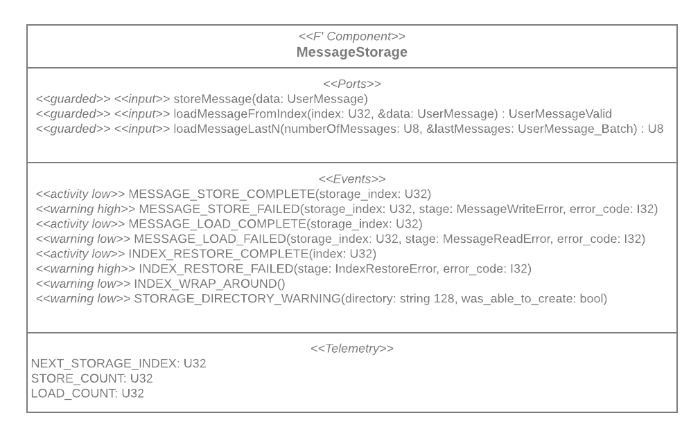

## Purpose
Present and explains my work on MEMESat BBS Message Storage component.

Target Audience:
- Alice: Recruiter at XYZ Autos GmBH. HR Abteilung. Kaum Fachwissen
- Bob: Software Engineering Lead at Munich Dynamics. Softwareengineering und Robotikfachwissen
- Charly: UGA undergrad 2nd year. CE major. Team Member at SSRL that needs to fix a bug in my code after I have left.
- Danny: UGA undergrad 2nd year. CS major. Team Member at SSRL that needs to write a component which uses mine.

## Questions to answer

- Alice: What was the project about?
- Alice: What skills did he learn that apply to our job offering?
- Alice: Why was it challenging?
- Bob: What technical challenges did he solve?
- Bob: What technologies did he use? Do they match the one we use?
- Bob: Does he have good coding skills and does he follow software engineering best practices X
- Bob: Is his documentation easy to understand? X
- Charly: What do the different parts of the code do?
- Charly: Why is X implemented like that and not like ...?
- Charly: What can I change without breaking the design or functionality?
- Danny: How do I use the component?
- Danny: What is the component supposed to do? What is it for?

## Content
- UML Class Diagramm / F' component diagram for black box view
- ??? Diagram for the internal organization / flow

# MessageStorage Component Documentation
## Summary
<!-- - Alice: What was the project about?
- Alice: What skills did he learn that apply to our job offering? -->

The `MessageStorage` component is a passive F' component responsible for storing and loading messages of type
`UserMessage`
on the file system.

## Interface to Other Components
<!-- Danny: How do I use the component? -->
### Component Diagram

### Ports
Other components which want to use `MessageStorage` to store a message need to call its ports.
* `storeMessage`: Stores a single given message
* `loadMessageLastN`: Loads a given number of the most recently stored messages. I.e., messages are handled in last-in-first-out order. The loaded messages are returned in a batch which is defined as a type.
* `loadMessageFromIndex`: Loads a single message from a provided index. The index is an indetifier number internal to 
  the component. This port is only useful if the user knows what index they are looking for, e.g. from an event or 
  from telemetry data emitted by the component

### Events and Telemetry
The component emits an event every time 
* it successfully stores a message (`MESSAGE_STORE_COMPLETE`),
* it fails to store a message (`MESSAGE_STORE_FAILED`),
* it successfully loads a message (`MESSAGE_LOAD_COMPLETE`),
* it fails to load a message (`MESSAGE_LOAD_FAILED`).

The name in the brackets is the type of the emitted event. For every cause of an event, a different type is used. 

Furthermore, the component emits additional events and telemetry upon success or failure of some internal opertions. For a full definition, refer to `Ref/BBSMessageStorage/BBSMessageStorage.fpp`.

## Dependencies
<!-- - OSAL: OS::File and OS::Directory -->
This component depends on the Operating System Abstraction Layer (OSAL) of F'. More specifically, it uses `OS::File`,
`OS::Directory`, and `OS::FileSystem` which means that these two classes must be implemented for the underlying
Operating System.

## Internal Design
<!-- 1 Block per design that I want to highlight
  * Challenge
- Bob: What technical challenges did he solve?
- Charly: Why is X implemented like that and not like ...?
  * Resulting Design Decision
- Bob: What technologies did he use? Do they match the one we use?
- Charly: What do the different parts of the code do?
- Charly: What can I change without breaking the design or functionality? -->

### Storage Format
---
**Challenge**

The component should store each message in a separate file. The component can assume that it is given access to a *storage directory* on the file system to store these files. 

The component should not crash even if 
* files other than the ones written by the component are (accidentally) put into the storage directory 
* files the component wrote to the storage directory are corrupted. This is a plausible scenario as radiation can cause bit error on the storage device.

**Resulting Design Decision**

Every message is stored with a unique file name in the storage directory (see [Indexing](#indexing)).

Each message file follows the following format consisting of the following.
* Delimiter: A unique byte value that is expected as the first byte of every stored message file. Thus, we prevent basic protection against trying to load files as message files which do not originate from the `MessageStorage` component. 
* Message Length: A `U32` that indicates how long the byte-serial representation of the message is. It helps to verify that the correct number of bytes is read and deserialized when loading the actual message from the file
* Message Content: The byte-serial representation of the message data. It contains everything needed to fully restore a message so that the message object obtained from loading is the same as the one provided for storing.

### Indexing
---

**Challenge**
* The component needs to give messages a file name that is different from the messages already stored.
* It 
also must be able iterate the messages backwards in order of arrival to provide the capability to load the last n
stored messages. 
* Assume no index can be infered from the message content.

**Resulting Design Decision**

The component assigns every message an index when starts an attempt to store the message. The index is a `U32` and simply counted upwards every time a new message is about to be stored. 

The index bijectively defines the file name. The file name format is '`<id>.bbsmsg`' where `<id>` is replaced with the index number.

The index is starts counting at 1 past the last index of a message found in the storage directory upon start-up of the component. If the component does not find any messages upon start-up, the index starts at 1. Restoring the index is implemented in `restoreIndexFromHighestStoredIndexFoundInDirectory()`.

For the sake of simplicity, we assume that the index counter never exceeds the maximum of `U32`. If it does, it is wrapped around to 0. The assumption is realistic as `U32` can count over 4 trillion messages which is multiple magnitudes more than what we expect as defined in the mission success criteria.

### Message Type
---
**Challenge**

At the time this component was developed, the decision of what content will make up a message was still pending. Furthermore, this decision might change in the future.

**Resulting Design Decision**

The component encapsulates a message in the type `UserMessage`. 

To make the component as independent of this type as possible, the component uses knowledge about this type only in a few very conciously choosen locations: 
* The component receives `UserMessage`s via its ports for communication with other components. Thus, the handler methods for port invocations know that the concrete type of messages is `UserMessage`.
* In all other places of the component, the concrete type `UserMessage` is hidden behind the abstract class `Serializable`. Consequently, in all of these place, the only assumption the component makes about the messages it is supposed to store is that they can be serialized into and deserialized from a raw byte buffer. No other assumptions are needed to store it in a file.

Therefore, the handler methods receive a message as a `UserMessage` but only call other methods in the component by passing them a base class pointer of type `Serializable` to the message.

### Serialization and Writing to File
---
**Challenge**

To write a message to a file, the message type must be serialized into a raw byte buffer. The address of that raw buffer must then be used to make a system call to the operating system.

**Resulting Design Decision**
- Serialize messages and other data by calling the framework's `Serializable` interface on the type which is to be serialized
- Serialize data to a buffer which is allocated on the stack to avoid dynamic memory allocation. The buffer is implemented as a local class `StackBuffer` inside the `MessageStorage` component.

---

The component treats the message type `UserMessage` as a black-box 

## Test Summary
TODO