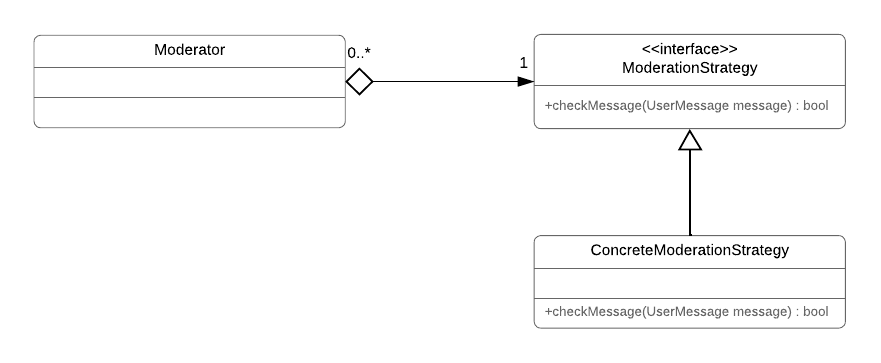

# Moderator Component Documentation
## Summary
The `Moderator` component is a passive F' component that decides whether received messages are stored or discared based on a set of moderation rules.
## Requirements
### Functional Requirements
Requirement | Description | Verification Method
---- | ---- | --------------
F-MOD-010 | The component shall provide an input port that accepts a message | Unit Test
F-MOD-020 | The component shall provide an output port that outputs every message received on the input port in F-MOD-010 iff the message passes a moderation check | Unit Test
F-MOD-030 | The component's moderation check shall let a message pass the moderation check in F-MOD-020 iff it meets all of the specified moderation criteria M-MOD-* | Unit Test

### Moderation Criteria
Criteria | Description | 
----------- | ---------------------- | 
M-MOD-010 | *This section cannot be published to ensure the security of the missions at the University of Georgia's Small Satellite Research Laboratoy which use the UserMessage system.*

### Non-functional Requirements
Requirement | Description | Verification Method
----------- | ----------- | -------------------
NF-MOD-010 | The component shall be highly adaptable and extendible to different and new moderation criteria | Manual code review

## Necessity
An onboard moderation is necessary because the satellite is supposed to receive messages from HAM radio users. These users send their messages to the satellite using their own radio equipment. Consequently, there is no way to check the content of their message prior to being received on the satellite.

However, one of the UserMessage System's requirements is to ensure that no inappropriate messages are downlinked by the satellite. We chose to fulfill this requirement by rejecting an inappropriate message when it is received and thus before it is stored on the satellite.

## Interface to Other Components

## Dependencies
The component depends on an implementation of the moderation criteria in a `ModerationStrategy` object. Its is injected into the constructor of the `Moderator` component via dependency injection.

## Internal Design
### Adaptability to Changing Moderation Criteria

**Challenge**

The moderation criteria are defined by the application in which the UserMessage System is used. Thus, developers using this project should be able to define their own moderation criteria and provide their own implementation of the checks for these criteria

**Resulting Design Decision**

The components uses the strategy design pattern. An object which implements the `ModerationStrategy` strategy interface can be injected into the component in its constructor. The `ModerationStrategy` interface requires a single method, which has the signature `bool checkMessage(UserMessage message)`. 

By injecting different implementations of the interface into the component, developers can realize different moderation criteria. Hence, the code of the `Moderator` component does not change if the moderation criteria `M-MOD-*` change.

