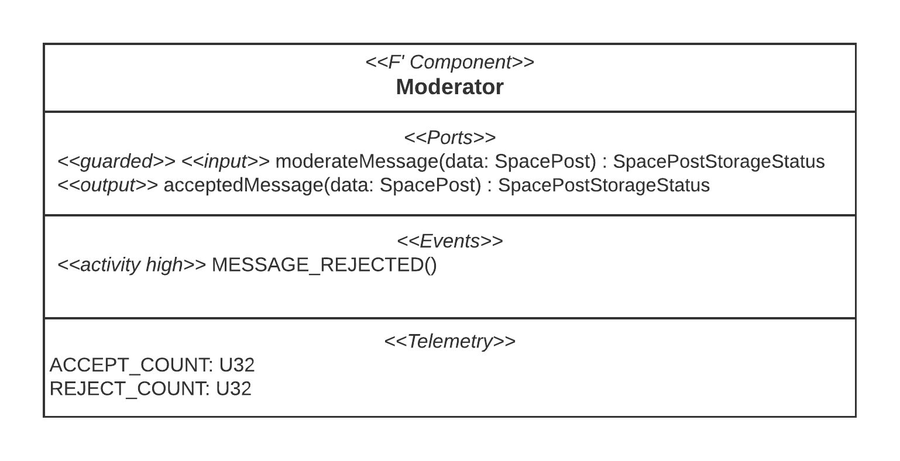
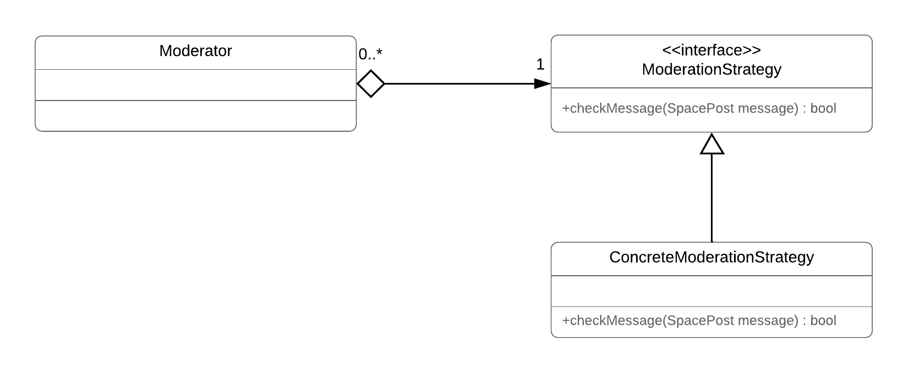

# Moderator Component Documentation
## Summary
The `Moderator` component is a passive F' component that decides whether received messages are stored or discarded based on a set of moderation rules.

## Necessity
An onboard moderation is necessary because the satellite is supposed to receive messages from HAM radio users (see [Concepts of SpacePosts](../../README.md#the-concept-of-spaceposts)). These users send their messages to the satellite using their own radio equipment. Consequently, there is no way to check the content of their message prior to receiving them on the satellite.

However, one of the SpacePost system's requirements is to ensure that no inappropriate messages are published by the satellite. We chose to fulfill this requirement by rejecting an inappropriate message when it is received and thus before it is stored on the satellite.

## Requirements
### Functional Requirements
Requirement | Description | Verification Method
---- | ---- | --------------
F-MOD-010 | The component shall provide an input port that accepts a message. | Unit Test
F-MOD-020 | The component shall provide an output port that outputs every message received on the input port in F-MOD-010 iff the message passes a moderation check. | Unit Test
F-MOD-030 | The component's moderation check shall let a message pass as in F-MOD-020 iff it meets all of the specified moderation criteria M-MOD-*. | Unit Test

### Moderation Criteria
Criteria | Description | 
----------- | ---------------------- | 
M-MOD-010 | *This section cannot be published to ensure the security of the missions at the University of Georgia's [Small Satellite Research Laboratory](http://www.smallsat.uga.edu/) which use the SpacePost system.*

### Non-functional Requirements
Requirement | Description | Verification Method
----------- | ----------- | -------------------
NF-MOD-010 | The component shall be highly adaptable and extendible to different and new moderation criteria. | Manual code review

## Interface to Other Components
To use the `Moderator`, it needs to be placed on a connection from the `Transceiver` to the `MessageStorage`. The `Moderator` will take in all received messages on its input port and only output those that pass the moderation check.

### Component Diagram

For details on the component's interface definition, refer to [`Moderator.fpp`](../../Moderator/Moderator.fpp).

## Dependencies
The component depends on an implementation of the moderation criteria in a `ModerationStrategy` object. It is injected into the constructor of the `Moderator` component via **dependency injection**.

## Internal Design
### Adaptability to Changing Moderation Criteria

**Challenge**

The moderation criteria are defined by the application in which the SpacePost system is used. Thus, developers using this project should be able to define their own moderation criteria and provide their own implementation of the checks for these criteria.

**Resulting Design Decision**

The component uses the **strategy design pattern.** An object which implements the `ModerationStrategy` strategy interface can be injected into the component in the constructor via the **dependency injection pattern**. The `ModerationStrategy` interface requires a single method, which has the signature `bool checkMessage(SpacePost message)`. 

By injecting different implementations of the interface into the component, developers can realize different moderation criteria. Hence, the code of the `Moderator` component does not change if the moderation criteria `M-MOD-*` change.

## Test Summary
*The unit tests for this component were not part of my work at the University of Georgia's Small Satellite Research Laboratory and are thus not included in this repository. Please refer to the [unit tests of the MessageStorage component](../MessageStorage/UnitTestDocumentation.md) for an example of unit tests I developed.*