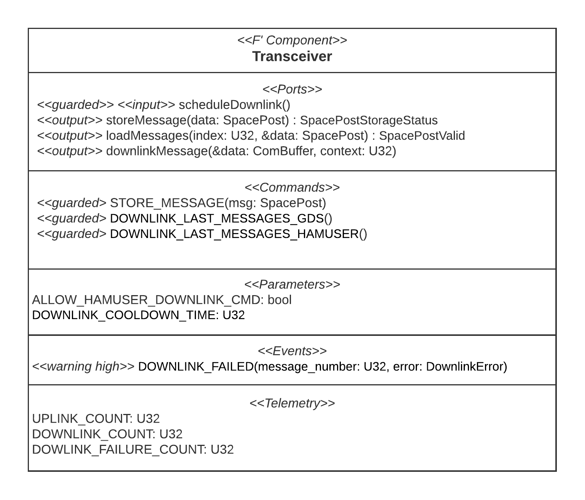

# Transceiver Component Documentation
## Summary
The `Transceiver` component is a passive F' component that receives messages from users on the ground and downlinks messages to users on the ground.
## Necessity
The `MessageStorage` component handles the concern of storing SpacePosts on the satellite which is a very clear task. In contrast, the definition of how users (ground station operators and amateur radio users) can interact with the satellite needs to be defined in a way that conforms with the satellite mission's goals. 

Consequently, it is a wise decision to model the interaction of users with the satellite for SpacePosts separately from the storage logic.

The interaction logic, which is encapsulated here in the `Transceiver`, can thus be replaced to realize the SpacePosts system with different interaction rules if needed.
## Requirements
### Functional Requirements
Requirement | Description | Verification Method
----------- | ----------- | -------------------
F-TRA-010 | The component shall provide a command that stores a given string as a message on the satellite | Unit test, integration test
F-TRA-020 | The component shall provide a command for ground station operators to initiate a downlink of a certain number of last stored messages, each as a string | Unit test, integration test
F-TRA-021 | The component shall provide a command for HAM radio users to initiate a downlink of a certain number of last stored messages, each as a string | Unit test, integration test
F-TRA-022 | The component shall provide a way to configure, during runtime, whether the command in F-TRA-021 is executed or rejected when it is received | Unit test
F-TRA-023 | The component shall automatically configure itself to reject commands as in F-TRA-022 every time the satellite reaches critical power | Manual code review
F-TRA-024 | The component shall only execute the command in F-TRA-021 if a certain amount of time has passed since the last downlink of SpacePosts by the component, no matter in which way it was triggered | Unit test
F-TRA-025 | The component shall provide a way to configure the amount of time in F-TRA-024 during runtime | Unit test
F-TRA-028 | The component shall provide a scheduling input port which can be connected to the output port of an active rate group. Every time the port is called, the component initiates a downlink of a certain number of last stored messages as a string | Unit test, Integration test
F-TRA-030 | Downlinking messages shall be performed in one single transmission for each message | Unit test 
F-TRA-050 | In every downlink, the downlinked messages should be the messages which have been stored the most recently measured from the time of the downlink (which could be different from the time of the request) | Integration test

### Non-functional Requirements
Requirement | Description | Verification Method
----------- | ----------- | -------------------
NF-TRA-010 | The number of last messages to downlink in F-TRA-020, F-TRA-021, and F-TRA-028 (same number for both) must be configurable but is constant during runtime | Manual code review
NF-TRA-020 | The component shall be adaptable to scheduling and triggering downlinks from different sources and for different reasons | Manual code review

## Interface to Users and Other Components
Users (ground station operators and amateur radio users) can interact with the component by sending commands for it from the ground to the satellite. The F' framework handles receiving and forwarding commands to the component on the satellite.

### Commands
* Ground station operators and amateur radio users can send messages that they wish to publish on the satellite in the `STORE_MESSAGE` command.
* Ground station operators can send the `DOWNLINK_LAST_MESSAGES_GDS` command to request all recently published messages from the satellite. The satellite's authentication component ensures that only ground station operators can use this command.
* Amateur radio users can send the `DOWNLINK_LAST_MESSAGES_HAMUSER` command to request all recently published messages from the satellite, too. However, this command is restricted by a cooldown timer and can be disabled by ground station operators.

The `Transceiver` can hence be seen as a **façade** to the SpacePosts system on the satellite. It is the only way for SpacePosts into and out of the satellite.

### Ports
The component is connected to other components of the flight software (see [SpacePost System Component Model](/README.md#component-model)) via ports. It translates the commands it receives into action on the satellite by initiating these actions via calls to other components through the ports.

For a definition of what the individual ports of the components do, refer to [`Transceiver.fpp`](../../Transceiver/Transceiver.fpp). //TODO link

### Component Diagram

For details on the component's interface definition, refer to [`Transceiver.fpp`](../../Transceiver/Transceiver.fpp). //TODO link

## Dependencies
Even though this component requires three other components (see [SpacePost System Component Model](/README.md#component-model)) to provide the functionality that it is supposed to provide in the SpacePost system, the code for this component is completely independent of the components it requires. The components communicate through well-defined F' framework component ports and thus avoid any C++ code dependencies.
  

## Internal Design
### Downlinking Messages

**Challenge**

Multiple messages need to be downlinked to the ground station.

**Resulting Design Decision**

The messages are transmitted in multiple transmissions with one transmission per message. Thus, the packet size is kept small. Furthermore, if a transmission fails, some messages are potentially successfully transmitted while only some others fail.

### Requesting Downlinks
**Challenge** 

Access to the command for requesting a downlink of messages shall always be available to ground station operators but restrictable for HAM radio users.

**Resulting Design Decision**

Introduce two separate commands for F-TRA-020 and F-TRA-021 even though they have the same functionality. That simplifies handling during authentication and enabling / disabling command execution.

**Challenge**

Whether the command in F-TRA-021 is executed or rejected must be configurable during runtime. Likewise, the cooldown time in F-TRA-024 must be configurable during runtime.

**Resulting Design Decision**

Provide an F' parameter `ALLOW_HAMUSER_DOWNLINK_CMD` in the component which enables and disables the execution of the command. 

Similarly, the F' parameter `DOWNLINK_COOLDOWN_TIME` configures the number of seconds that must have passed since the last downlink for the HAM radio user downlink command to be executed when received.

Thanks to framework support, the parameters are configurable from the ground station.

**Challenge**

HAM radio user's command for requesting downlinks shall be disabled when the satellite goes into the critical power state.

**Resulting Design Decision**

Initialize the configuration parameter for F-TRA-021 to disable the execution. Every time the satellite enters the critical power state, the onboard computer running the flight software is restarted. Thus, the component will be freshly initialized and the execution disabled.

## Test Summary
*The unit tests for this component were not part of my work at University of Georgia's Small Satellite Research Laboratory and are thus not included in this repository. Please refer to the [unit tests of the MessageStorage component](../MessageStorage/UnitTestDocumentation.md) for an example of unit tests I developed.*